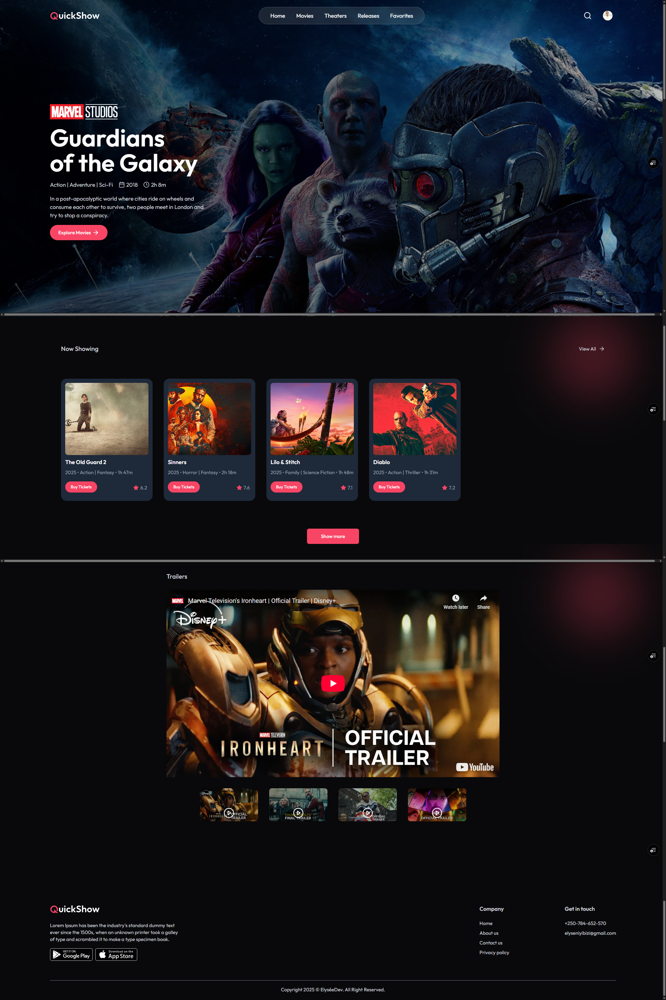
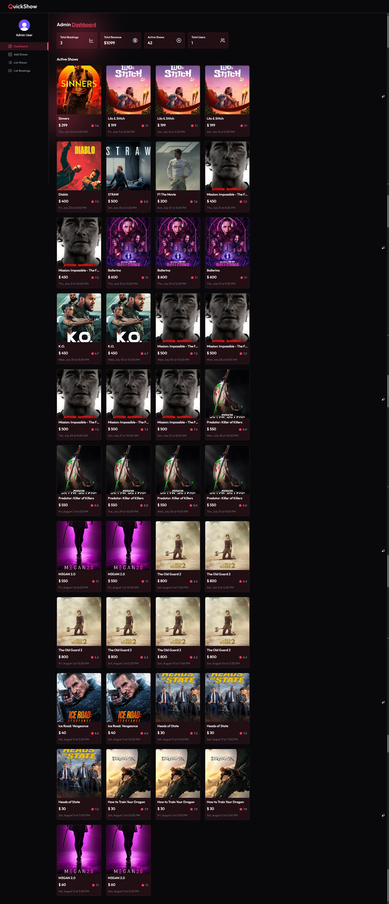

<div align="center">

# QUICKSHOW 

*Seamless Video Discovery. Effortless Entertainment Experience*


<br />

## 🎦 LIVE - DEMO 🌐
  
**UI** 👉 [LINK](https://quickshow-sigma-roan.vercel.app/)



<br /><hr /><br />

**Admin Dashboard** 👉 [LINK](https://quickshow-sigma-roan.vercel.app/admin)



</div>

---

### Deployment

The application is configured for deployment on Vercel with the included `vercel.json` files.

**Deploy to Vercel:**
```console
# Install Vercel CLI
npm i -g vercel

# Deploy
vercel --prod
```

---

## Contributing

1. Fork the repository
2. Create a feature branch (`git checkout -b feature/amazing-feature`)
3. Commit your changes (`git commit -m 'Add some amazing feature'`)
4. Push to the branch (`git push origin feature/amazing-feature`)
5. Open a Pull Request

### Development Guidelines

- Follow the existing code style and conventions
- Write meaningful commit messages
- Add tests for new features
- Update documentation as needed
- Ensure all tests pass before submitting PR

---

## License

This project is licensed under the MIT License. See the [LICENSE](https://github.com/elyse502/QuickShow/blob/main/LICENSE) file for details.

---

## Support

For support, email elyseniyibizi502@gmail.com or create an issue in the GitHub repository.

---

[⬆ Back to Top](#table-of-contents)

</div>


